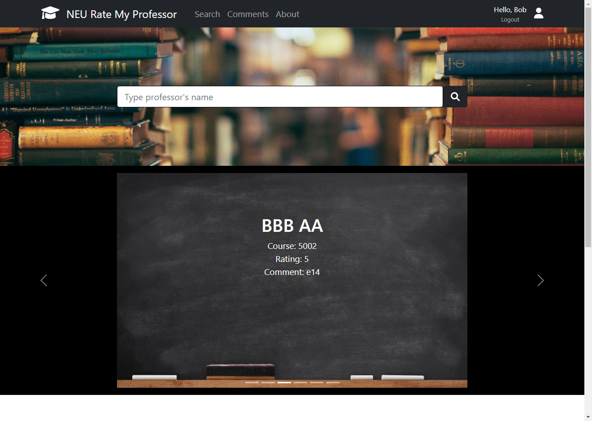
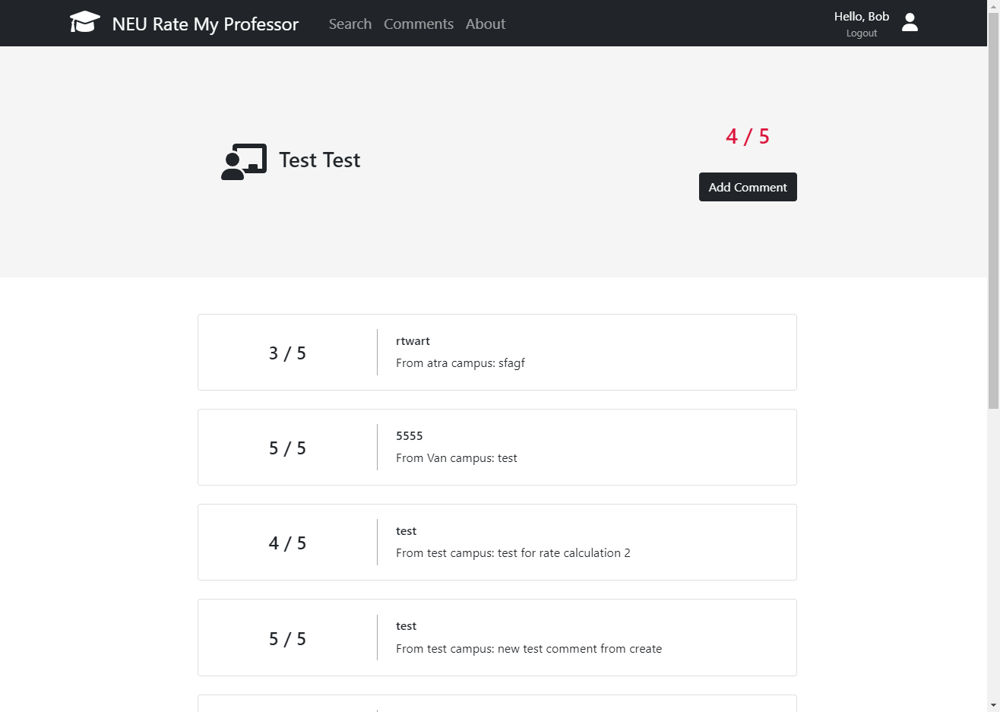

# Rate-My-Professor-NEU-CS

<!-- ABOUT THE PROJECT -->

## About The Project

This is a rate my professor website application for Northeastern University Computer Science master program.

Website Link: https://neu-rate-my-prof.herokuapp.com/

Demo: https://www.youtube.com/watch?v=2GlXF6pobAY&ab_channel=XuehanYi

### Built With

-   [Node.js](https://nodejs.org/)
-   [Express.js](https://expressjs.com/)
-   [React.js](https://reactjs.org/)
-   [Bootstrap](https://getbootstrap.com)

<!-- GETTING STARTED -->

## Getting Started

How to run the application locally.

### Prerequisites

Install npm in your local environment.

-   npm
    ```sh
    npm install npm@latest -g
    ```

### Installation

1. Clone the repo
    ```sh
    git clone https://github.com/yxhniord/Rate-My-Professor-NEU-CS.git
    ```
2. Install and run server application
    ```sh
    cd server
    npm install
    npm start
    ```
3. Install and run client application
    ```sh
    cd client
    npm install
    npm start
    ```

<!-- USAGE EXAMPLES -->

## Usage

Use this space to show useful examples of how a project can be used. Additional screenshots, code examples and demos work well in this space. You may also link to more resources.

<!-- ROADMAP -->

## Iteration

-   [x] Iteration 1

    1. Developed all the server-end API (CRUD)
    2. Created React components and placeholders to represent the functionalities
    3. Connected frontend and backend and realized the following functions:
        1. Jump to login/signup pages
        2. Search for professors by name or part of a name **_(eg. "AA", "bb","Test")_**
        3. Display professor's information
        4. Display user's information

-   [x] Iteration 2

    -   Server
        1. Add professor rate automatic calculation
        2. Change user model and controller to add more fields
        3. Change get professor list by name to be case-insensitive
        4. Secure user-related API calls
    -   Client
        1. Implement add-new-comment and update-existing-comment functionalities.
        2. Display user comments as carousel on homepage when user's logged in.
        3. Authenticate and authorize users to add/edit comments.
        4. Redirect user from Auth0 sign up page to information collection page.
        5. Improve accessibility and mobile responsiveness.

-   [x] Iteration 3

    -   Server
        1. Add display 5 professors by rate API.
    -   Client
        1. Implement add user feature.
        2. Implement delete comment feature.
        3. Implement YouTube API.
        4. Enforce authorization on protected pages.

-   [x] Iteration 4

    -   Server
        1. Fix bugs
    -   Client
        1. Add tests for all components
        2. Refractor codes to implement pagination and enhance code re-usability.
        3. Setup Redux store to prevent repetitive fetching of user information.

<!-- CONTRIBUTION -->

## Contribution

Contributions of all team members.

### Xuehan Yi

Server development

-   Database design
-   Server end API (CRUD for professor, user, comment)
-   Test for ratingDetails components

### Yuheng Miao

Client development

- Design frontend layout
- Implement pages for Home, SearchResults, ProfessorDetails, AddComment, EditComment and AddProfessor
- Write tests and refractor codes

### Zhiwei Bao

Client development

- Implement UserProfile page and Comment and CommentList components.
- Integrate user authentication (Signup/Login, Protected route) and Server API security.
- Add YouTube API to Home page
- Write tests and refractor codes

<!-- LICENSE -->

## License

Distributed under the MIT License.

<!-- CONTACT -->

## Contact

-   Xuehan Yi - yxhniord@gmail.com
-   Yuheng Miao - miaoyh1997k@gmail.com
-   Zhiwei Bao - zhiv.bao@gmail.com

Project Link: [https://neu-rate-my-prof.herokuapp.com/](https://neu-rate-my-prof.herokuapp.com/)

## Screenshots

### Homepage



### Professor Detail


